# COVID19-Python
Extracting COVID-19 Data with Python, Pandas and friends from the websites below:

 * https://www.worldometers.info/coronavirus/#countries 
 * https://opendata.ecdc.europa.eu/covid19/casedistribution/csv

scripts provided:
 - Jupyter Notebooks you can use to explore and experiment with the data.
 - The script that produces the Worldwide comparison graph
 - The script that provides France evolution
 - The script that provides country evolution
 
 ## Work in progress!
 I may improve this soon, stay tuned
 
 ## Sample Output
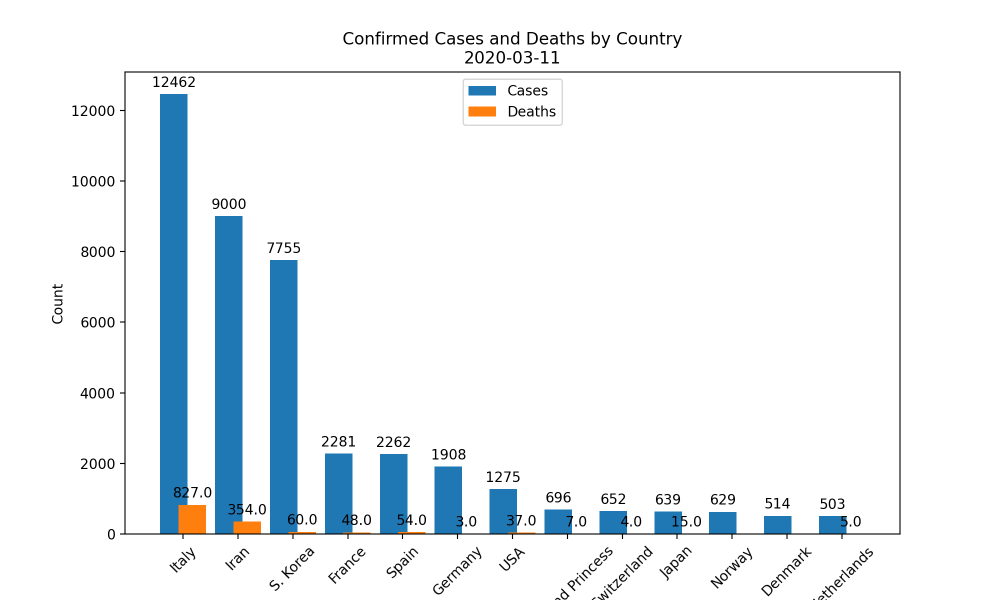

## History

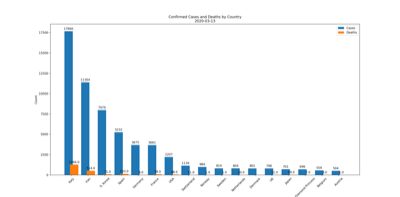
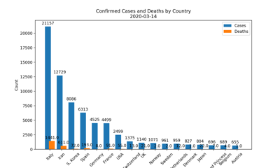
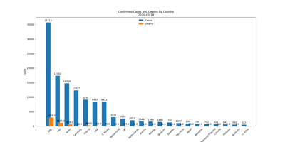
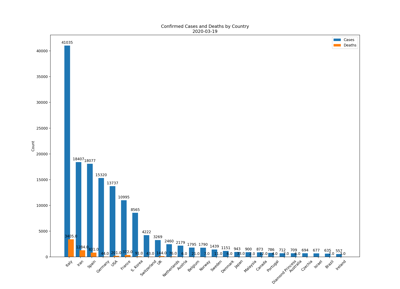
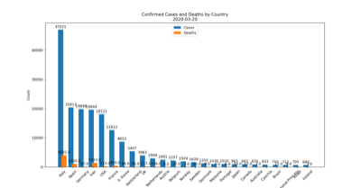
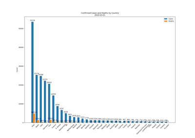
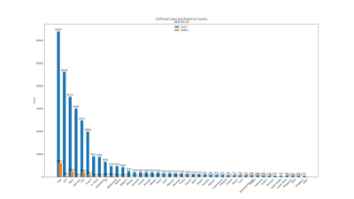
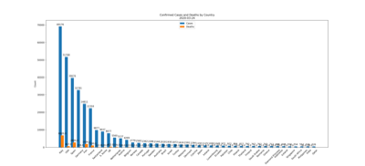
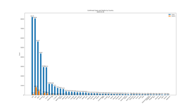
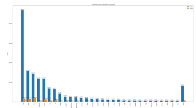
